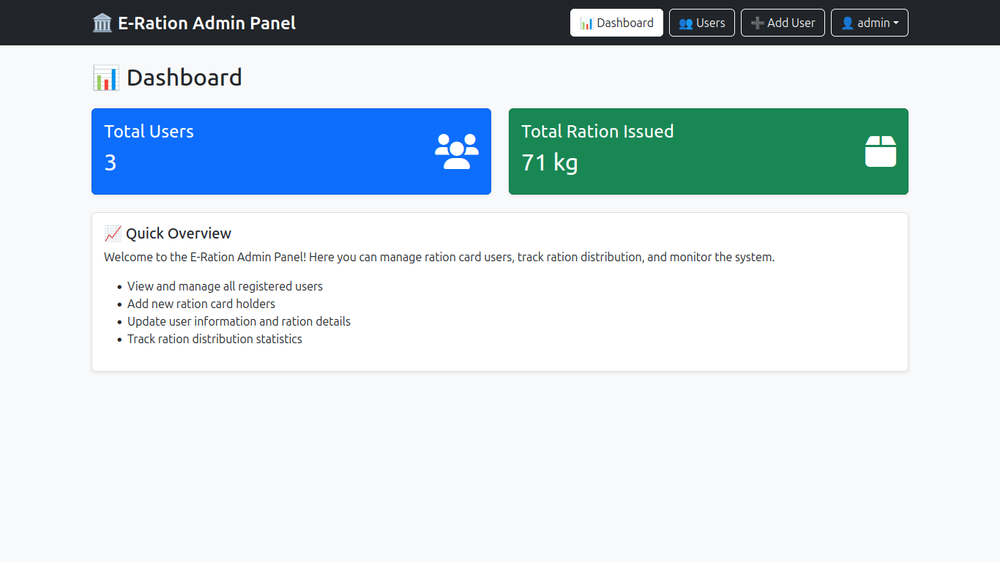
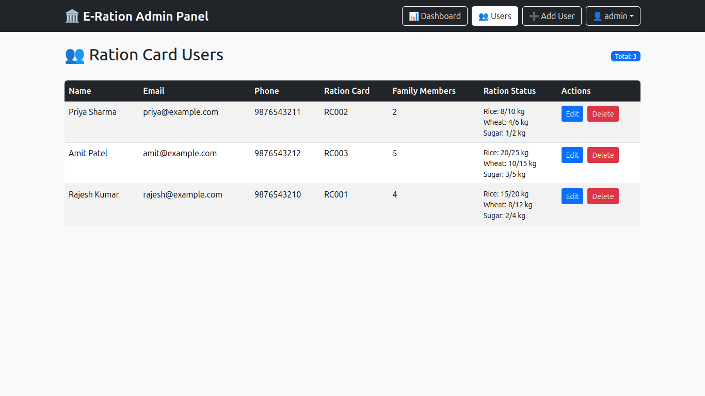
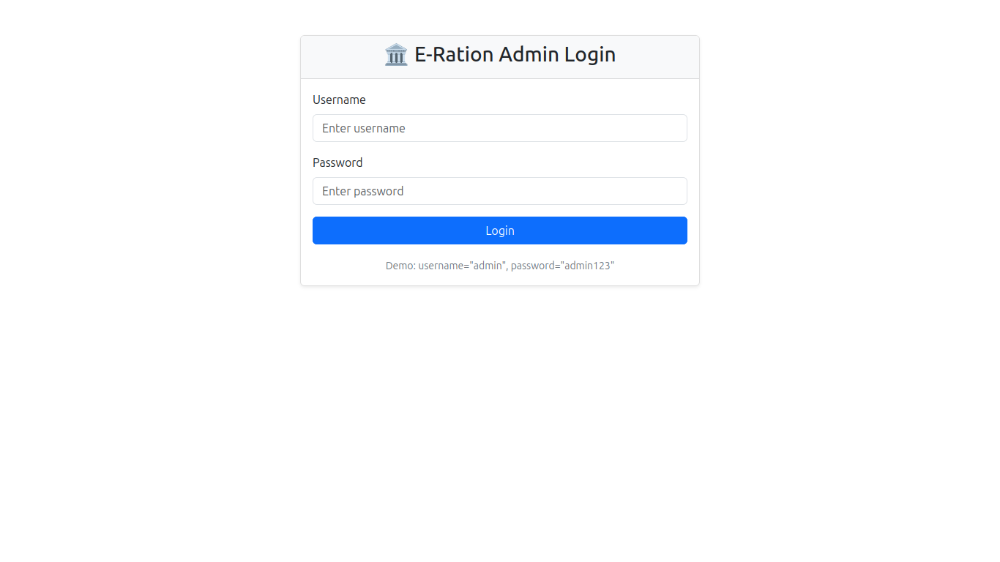

# 🌾 E-Ration Admin Panel

A complete **Full-Stack Admin Dashboard** to manage the Digital Ration System. This project automates quota calculations and manages user data securely.

---

## 📸 Project Screenshots

### 1. Admin Dashboard
> Real-time statistics of Total Users and Distributed Ration.

### 2. User Management List
> Manage users with automated quota calculation logic.

### 3. Secure Admin Login
> JWT Authenticated Login Page.

---

## ✨ Key Features
* **🔐 Secure Auth:** Admin login using JWT & Bcrypt.
* **📊 Smart Dashboard:** Visual analytics of ration distribution.
* **🤖 Auto-Calculation:** System automatically calculates Rice/Wheat/Sugar quota based on family members.
* **👥 CRUD Operations:** Add, Update, Delete ration card holders easily.

## 🛠️ Tech Stack
* **Frontend:** React.js, Bootstrap 5
* **Backend:** Node.js, Express.js
* **Database:** MongoDB

---
*Developed by Nitesh Srivastava*